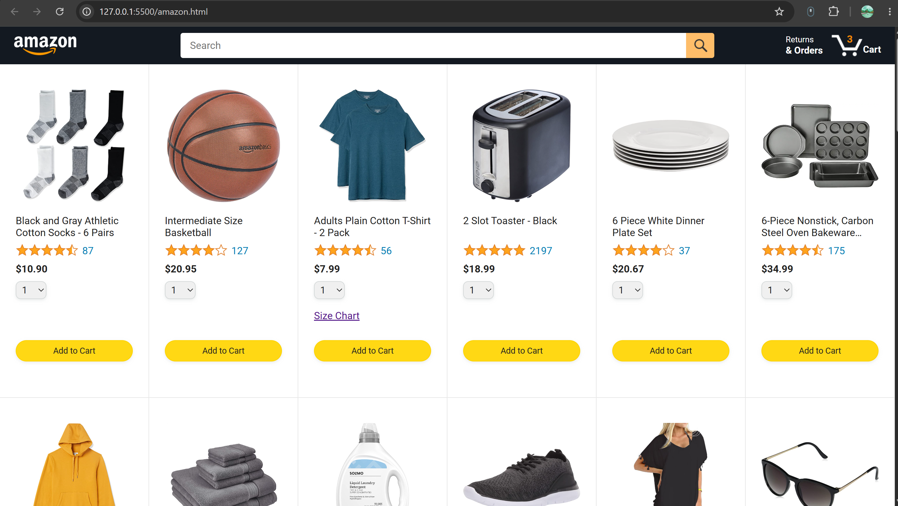
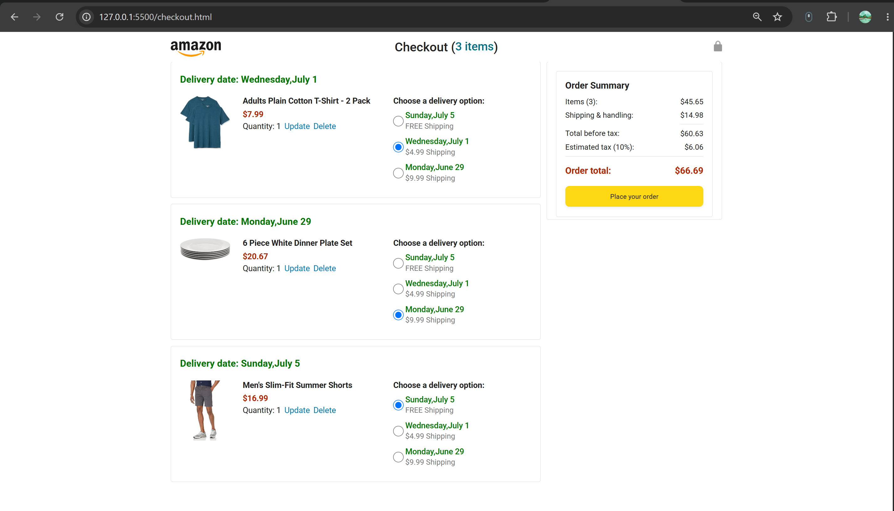
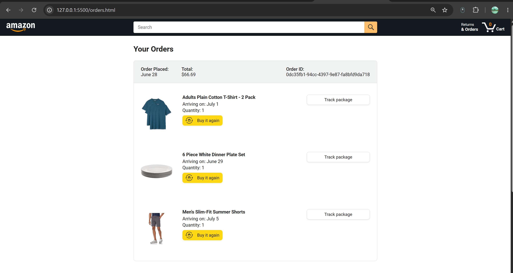
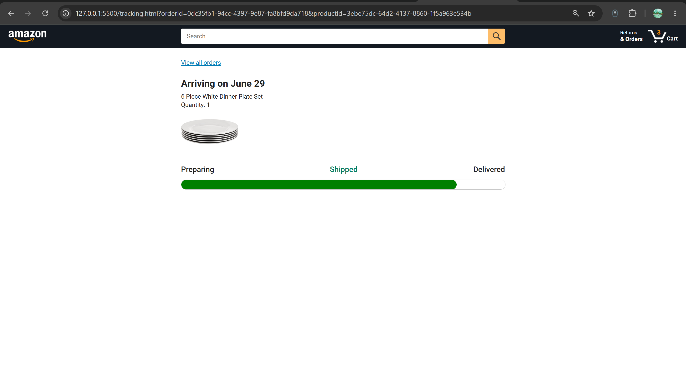

# Amazon Clone

A feature-rich Amazon-inspired e-commerce web application built using **HTML, CSS, and Vanilla JavaScript**. This project was developed as part of my self-learning journey to gain hands-on experience with modern JavaScript by building a real-world shopping application from scratch.

---

## Overview

This project replicates the core functionality of an e-commerce platform, providing users with a complete shopping experience—from browsing products to placing orders and tracking deliveries. It focuses on writing clean, modular JavaScript while implementing interactive UI components, asynchronous programming, and automated testing.

---

## Features

* Dynamic product listing
* Product search with real-time filtering
* Add to Cart functionality
* Interactive cart quantity update
* Remove items from cart
* Dynamic cart quantity indicator
* "Added to Cart" confirmation notification
* Checkout with delivery option selection
* Automatic price and shipping calculations
* Order placement workflow
* Order history page
* Dynamic order tracking page
* Progress bar that updates based on the remaining delivery time
* Persistent cart and order data using Local Storage
* Backend API integration using Fetch API
* Automated unit testing with Jasmine

---

## Technologies Used

* HTML5
* CSS3
* JavaScript (ES6+)
* Fetch API
* Async/Await
* Local Storage API
* Day.js
* Jasmine

---

## JavaScript Concepts Implemented

* DOM Manipulation
* ES6 Modules
* Event Handling
* Object-Oriented Programming (OOP)
* Template Literals
* Data Attributes (`dataset`)
* Array Methods
* Higher-Order Functions
* Promises
* Async/Await
* URLSearchParams
* Local Storage
* Error Handling
* Dynamic Rendering
* Percentage-based Progress Calculation
* Unit Testing

---

## Additional Enhancements

Beyond the core project requirements, I implemented several additional features:

* **Interactive Quantity Update** – Users can edit product quantities directly from the cart using an inline update option.
* **Dynamic Product Search** – Implemented real-time product filtering based on the user's search input.
* **Dynamic Tracking Progress Bar** – Designed the tracking progress indicator to update automatically based on the percentage of time elapsed between the order date and estimated delivery date.
* Improved user interaction through responsive UI updates and cleaner component rendering.

---

## Testing

The project includes automated testing using **Jasmine**.

### Test Coverage

* Cart functionality
* Add to Cart logic
* Remove from Cart
* Quantity updates
* Delivery option updates
* Local Storage mocking
* Business logic validation
* Test suites using `beforeEach()` and `beforeAll()`

---

## Demo

A complete walkthrough showcasing:

* Product browsing
* Dynamic product search
* Cart management
* Quantity updates
* Checkout flow
* Order placement
* Order history
* Dynamic order tracking
* Jasmine test execution

> **Demo Video:** *(Add your LinkedIn or YouTube video link here.)*

---

## Screenshots

### Home Page

### Checkout Page

### Orders Page

### Tracking Page

---

## Future Improvements

* User authentication
* Payment gateway integration
* Product reviews and ratings
* Wishlist functionality
* Product sorting and advanced filters
* Backend database integration
* Responsive design enhancements
* Performance optimization

---

## Acknowledgements

This project was built while following the **SuperSimpleDev JavaScript Course** as part of my self-learning journey. In addition to the guided implementation, I independently enhanced the application by adding new features, improving interactivity, debugging issues, implementing automated tests, and strengthening the overall user experience.

---

## Author

**Sneha**

B.Tech Student | Aspiring Front-End Developer

If you found this project interesting, feel free to ⭐ the repository.
